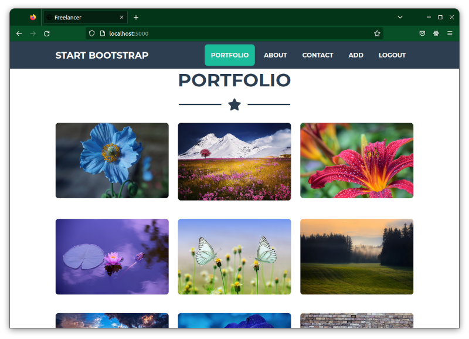
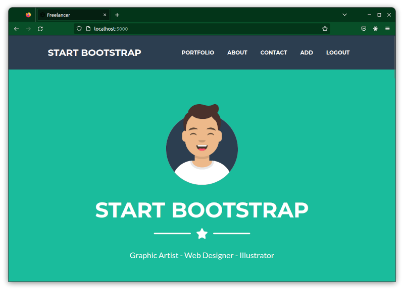
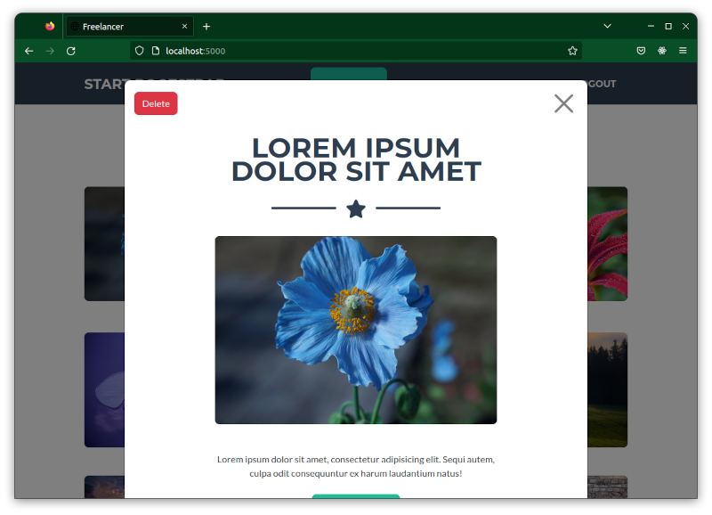
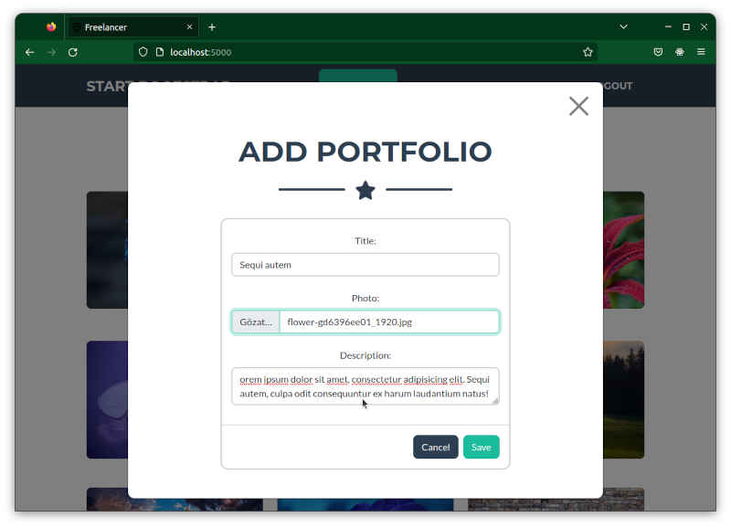

# Freelancer Web Site

Express JS kullanılarak tasarlanmış bir websitesidir. Tek sayfa bir uygulama olmakla beraber, yönetici için gerekli alanları modal üzerinden tamamladık.

Uygulamada portfolio bölümü dinamik ve diğer bölünler ise statik bir yapıya sahiptir.

Uygulama geliştirilikren hazır bir tema kullanılmıştır. Start Bootstrap - [Freelancer v7.0.6](https://startbootstrap.com/theme/freelancer).



## Kurulum

Uygulamayı forklayabilir veya dosyaları bilgisayarınıza indirebilirsiniz. Uygulamayı bilgisayarınızda bir klasöre indirdiğinizde.

- Komut satırını açın ve komut satırı üzerindenprojenizin olduğu dizine gidin.
- ```npm init``` komutu ile uygulamayı başlamak için hazırlayın.
- **.env** dosyasında **APP_MONGODB_DB_NAME=veri_tabani_adi**, **APP_MONGODB_FULL_URL=veritabani_tam_url** ve **APP_SESSION_SECRET_KEY=** alanlarını doldurun.
- ```node app``` komutu ile uygulamanızı çalıştırın.

Örnek **.env** dosyası şu şekilde olabilir.

```
PORT=5000
APP_MONGODB_DB_NAME=db-freelancer
APP_MONGODB_FULL_URL=mongodb://localhost:27017
APP_SESSION_SECRET_KEY=EkdsOpaaufaaa222UfaaaUUP
```

Burada veritabanı adını siz kendinize göre ayarlayabilirsiniz. MongoDB tam urlsini de, eğer şifre ve kullanıcı adı varsa onları da ekleyerek, eğer kendibilgisayarınızda bulunan bir test sunucunuz varsa  direk yukarıdaki şekilde kullanabilirsiniz.

APP_SESSION_SECRET_KEY ise rastgele oluşturulmuş bir stringdir.

Tüm işlemleri doğru yaptıysanız ```node app``` komutundan sonra sunucunuz çalışmaya başlayacaktır. Artık ```http://localhost:5000``` adresinden websayfasına ulaşabilirsiniz. İlk kullanımda ```http://localhost:5000/login``` adresinden bir yönetici ayarlaması yapabilirsiniz. Sadece tek bir yönetici / kullanıcıya izin veriliyor. Sonrasında yine ```http://localhost:5000/login``` adresinden giriş yaparak **ADD** linkine tıklayarak portfolio bölümüne gerekli resim ve bilgileri girebilirsiniz. 

## Kullanılan Teknolojiler

Uygulama Node JS temelli geliştirilmiştir. Kullanılan paketler aşağıda sıralanmaktadır.

- Express JS
- Bootstrap
- Mongodb
- express-session
- express-fileupload
- express-validator
- randomstring
- mongoose
- bcrypt
- dotenv
- ejs

## Ekran Görüntüleri

Uygulama ile ilgili bazı ekran görüntüleri.







